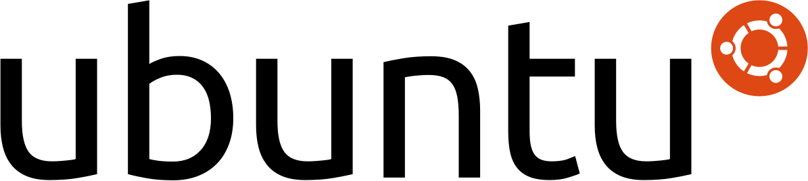
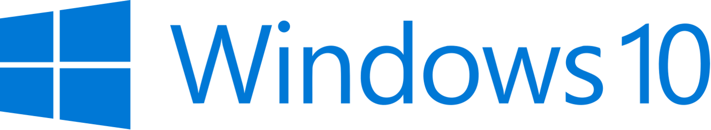

## Raspberry Pi 4

The Raspberry Pi 4 came out and it is a computer that fits in your pocket, it can run any code you want on it. It is very powerful and you can even run websites on it. It has:
* 2 USB 3 ports
* 2 USB 2 ports
* 1 HDMI port
* 2 Micro HDMI ports
* A Linux based system
* Energy port
* 3 GB of RAM

Examples of projects that use Raspberry Pi:
* Pi-Top
* Rob’s Raspberry Pi Dungeons and Dragons table

It has to Operating Systems: (but you can use other operating systems like Ubuntu and Windows 10)
* NOOBS
* Raspbian

With the Raspberry Pi 4 you can even hack (See all your passwords and websites you access), so use a VPN when you see one near you.
